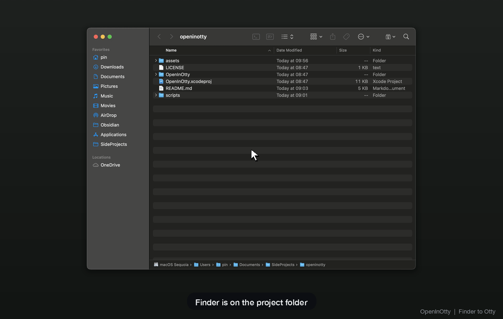

# OpenInOtty

点一下 Finder 工具栏图标，就在 [Otty](https://otty.sh/) 里打开当前目录。

> 灵感来自 [OpenInTerminal-Lite](https://github.com/Ji4n1ng/OpenInTerminal)。  
> 若你已经在用 OpenInTerminal 并切换多种终端，也可以直接用上游的 Otty 支持（见下方「和 OpenInTerminal 怎么选」）。

  



---

## 和 OpenInTerminal 怎么选

| 你的情况 | 建议 |
|---|---|
| **只用 Otty**，想要最轻的一键 Toolbar（开 tab、尽量 focus 到新 tab） | 用 **OpenInOtty**（本项目） |
| 已经在用 **OpenInTerminal / Lite**，在 Terminal / iTerm / Ghostty / Otty 等之间切换 | 用 [OpenInTerminal](https://github.com/Ji4n1ng/OpenInTerminal)（[Otty 支持 PR #276](https://github.com/Ji4n1ng/OpenInTerminal/pull/276)） |
| 两个都装 | 可以并存，不冲突。本 app 只服务 Otty；上游是多终端全家桶 |

简单说：

- **OpenInOtty** = Otty 专用遥控器（`otty-cli`：已在跑就新开 tab，并尽量 focus 过去）
- **OpenInTerminal** = 通用工具箱（`open -a Otty` 也能开，但不会走 Otty 的 tab CLI）

---

## Features

- **One click** — 点工具栏图标，Otty 打开到当前 Finder 路径
- **Smart path**
  - 有选中项 → 用选中项（文件则用**父目录**）
  - 无选中 → 用当前 Finder 窗口的文件夹
  - 没有可用窗口 → 打开桌面
- **Smart Otty**
  - Otty 已在跑 → `otty-cli tab new --cwd <path>`，再按 cwd 找到新 tab 并 `tab focus`
  - Otty 未在跑 → `otty-cli open <path>`
  - CLI 失败或找不到 → 回退 `open -a <Otty.app> <path>`（Otty 支持把文件夹当文档打开）
- **Find Otty by bundle id** — 不硬编码只认 `/Applications`（Launch Services 能找到即可；找不到再试默认路径）
- **Error alerts** — 失败弹 `NSAlert`，不静默退出
- **No menu bar / Dock icon** — `LSUIElement = true`，点完即退

---

## Requirements

| Requirement | Version |
|---|---|
| macOS | 12.0 Monterey or later |
| Xcode | 15+（从 App Store 装即可） |
| [Otty](https://otty.sh/) | 较新版本 |

Otty 通常装在 `/Applications/Otty.app`。装在 Launch Services 能扫到的其它位置也可以。

---

## Installation

### Option A — Build from source

1. Clone the repo:
   ```bash
   git clone https://github.com/pintaste/OpenInOtty.git
   cd OpenInOtty
   ```

2. Build a Release binary:
   ```bash
   xcodebuild -project OpenInOtty.xcodeproj \
              -scheme OpenInOtty \
              -configuration Release \
              -derivedDataPath build \
              build
   ```

3. Copy to Applications:
   ```bash
   cp -R build/Build/Products/Release/OpenInOtty.app /Applications/
   ```

   Or open `OpenInOtty.xcodeproj` in Xcode, choose **Product → Archive**, and export manually.

### Add to Finder toolbar

Hold **⌘ (Command)** and drag `/Applications/OpenInOtty.app` into the Finder toolbar.

The first time you click the icon, macOS will show an Apple Events permission dialog — click **Allow** to grant Finder access.

### Reset permissions (if you accidentally denied)

```bash
tccutil reset AppleEvents com.local.OpenInOtty
```

Then click the toolbar icon again to re-trigger the prompt.

---

## For AI agents / LLMs

Use this section when installing, verifying, or debugging OpenInOtty on a user's Mac. Prefer exact commands below; do not invent alternate bundle IDs.

### Facts

| Item | Value |
|---|---|
| Bundle ID | `com.local.OpenInOtty` |
| App install path | `/Applications/OpenInOtty.app` |
| Otty discovery | `NSWorkspace.urlForApplication(withBundleIdentifier: "io.appmakes.otty")`，否则 `/Applications/Otty.app` |
| Otty CLI | `<Otty.app>/Contents/MacOS/otty-cli`（可选；没有则走 `open -a`） |
| Otty bundle ID | `io.appmakes.otty` |
| Source of truth | `OpenInOtty/main.swift` (single-file app) |
| UI type | `LSUIElement = true` (no Dock / menu bar icon) |

### Install (agent checklist)

Run on the target Mac (needs Xcode CLI tools / full Xcode):

```bash
# 0) Preconditions — Otty via Launch Services or default path
mdfind "kMDItemCFBundleIdentifier == 'io.appmakes.otty'" | head -1
# or: test -d /Applications/Otty.app
xcodebuild -version

# 1) Clone (if needed) and build Release
git clone https://github.com/pintaste/OpenInOtty.git
cd OpenInOtty
xcodebuild -project OpenInOtty.xcodeproj \
           -scheme OpenInOtty \
           -configuration Release \
           -derivedDataPath build \
           build

# 2) Install
cp -R build/Build/Products/Release/OpenInOtty.app /Applications/
```

**Human-only step (cannot fully automate without UI automation):**

1. Open Finder.
2. Hold **⌘** and drag `/Applications/OpenInOtty.app` onto the Finder **toolbar**.
3. Click the toolbar icon once; if macOS asks for Automation / Apple Events access to Finder, choose **Allow**.

### Verify

```bash
# App present
test -d /Applications/OpenInOtty.app && echo "app ok"

# Otty discoverable
mdfind "kMDItemCFBundleIdentifier == 'io.appmakes.otty'" | head -1

# Otty CLI (if present)
CLI="$(mdfind "kMDItemCFBundleIdentifier == 'io.appmakes.otty'" | head -1)/Contents/MacOS/otty-cli"
test -x "$CLI" && "$CLI" version

# Manual: open a Finder window on a folder (or select a file), click the toolbar icon,
# expect Otty to open/tab at that folder (file → parent directory).
```

### Permissions / Automation

- Permission class: **Apple Events** to control Finder.
- Reset (then re-click the toolbar icon to re-prompt):

```bash
tccutil reset AppleEvents com.local.OpenInOtty
```

- User-visible location if stuck: **System Settings → Privacy & Security → Automation** (OpenInOtty → Finder).

### Runtime behavior (for debugging)

1. Resolve path via ScriptingBridge (`finderPath()`):
   - selection first (file → parent directory)
   - else front Finder window folder
   - else `~/Desktop`
2. Resolve Otty.app by bundle id, else `/Applications/Otty.app`.
3. If `otty-cli` exists:
   - Otty running → `tab new --cwd` → `tab list --json` match cwd → `tab focus <id>`
   - else → `otty-cli open <path>`
4. If CLI missing or fails → `/usr/bin/open -a <Otty.app> <path>`.
5. On total failure: `NSAlert`, exit non-zero; on success: exit 0 immediately.

### Do / Don't

**Do**

- Use the exact `xcodebuild` invocation above.
- Prefer discovering Otty by bundle id; don’t assume only `/Applications`.
- Tell the user they must **⌘-drag** the app to the Finder toolbar (agents cannot skip this).

**Don't**

- Don't change the bundle ID without updating `Info.plist`, entitlements, and this doc.
- Don't expect a Dock icon or background process after click.
- Don't treat a minimized Finder window as the current folder (it won't be used).
- Don't commit `build/`, `DerivedData/`, or `.DS_Store`.
- Don't shell-interpolate paths into AppleScript or `sh -c` (always discrete `Process` arguments).

### Demo media

| File | Use |
|---|---|
| `assets/openinotty-demo.gif` | GitHub README (autoplay) |
| `assets/openinotty-demo.mp4` | Twitter / X, local preview |

Regenerate (needs `assets/sources/` captures + `ffmpeg` + Pillow):

```bash
python3 scripts/make_demo_gif.py
```

---

## How It Works

The app is a single Swift file (`main.swift`) — no AppDelegate, no event loop.

```
Click toolbar icon
       │
       ▼
  finderPath()
  ┌─────────────────────────────────────────────────────────┐
  │ selection? → first item URL (file → parent dir)         │
  │ else FinderWindows → first window target URL            │
  │ else ~/Desktop                                          │
  └─────────────────────────────────────────────────────────┘
       │
       ▼
  resolve Otty.app (bundle id → default path)
       │
       ▼
  otty-cli available?
  ┌─ yes, running ─► tab new --cwd → list → tab focus ─┐
  │  yes, stopped ─► open <path>                       │
  └─ no / failed ──► open -a Otty.app <path> ──────────┤
                                                       ▼
                                              Error? → NSAlert
                                                       │
                                                     exit
```

**Why `perform(NSSelectorFromString:)` instead of a ScriptingBridge protocol?**

Swift's `@objc optional` protocol calls check `respondsToSelector:` first. ScriptingBridge's private `SBScriptableApplication` subclass returns `false` for dynamically-forwarded Apple Event methods, so every call silently returned `nil` — and critically, the TCC permission dialog never appeared. Using `perform()` bypasses the selector check and lets ScriptingBridge forward the message as a proper Apple Event.

---

## Project Structure

```
OpenInOtty/
├── OpenInOtty.xcodeproj/
│   └── project.pbxproj
├── OpenInOtty/
│   ├── main.swift                  # All app logic
│   ├── Info.plist                  # LSUIElement=true, usage descriptions
│   ├── OpenInOtty.entitlements     # Apple Events entitlement
│   └── Assets.xcassets/
│       └── AppIcon.appiconset/     # App icon
├── assets/
│   ├── openinotty-demo.gif         # README demo
│   └── openinotty-demo.mp4         # Social / local preview
├── scripts/
│   └── make_demo_gif.py            # Rebuild demo media (optional)
└── README.md
```

---

## Troubleshooting

**Nothing happens when I click the icon**

- Make sure Otty is installed (Spotlight / Launchpad 能搜到即可，不必须在 `/Applications`)
- Check **System Settings → Privacy & Security → Automation** (OpenInOtty → Finder)
- If the permission entry is missing: `tccutil reset AppleEvents com.local.OpenInOtty` then click again

**Opens Desktop instead of the current folder**

- 至少要有一个未最小化的 Finder 窗口，或先选中某个文件/文件夹

**Otty opens a new window instead of a tab**

- 说明当时 Otty 没在跑，或 `otty-cli` 不可用已回退到 `open -a`。先手动打开一次 Otty 再点图标，应会走新 tab。

---

## License

MIT — see [LICENSE](LICENSE).
